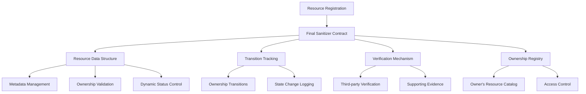

# Async Final Sanitizer

A cutting-edge blockchain solution for decentralized resource lifecycle management and comprehensive verification on the Stacks blockchain. This innovative platform provides an immutable, secure, and transparent mechanism for tracking, validating, and managing digital and physical resources.

## Overview

Async Final Sanitizer empowers users with advanced capabilities:
- Register resources with rich, detailed metadata
- Securely transfer ownership
- Maintain comprehensive provenance tracking
- Enable third-party verifications
- Dynamically manage resource status
- Access complete historical records

### Key Use Cases
- Provenance tracking
- Asset verification
- Compliance documentation
- Supply chain management
- Intellectual property registration
- Decentralized audit trails

## Architecture

The system leverages a robust smart contract architecture designed for flexibility, security, and comprehensive tracking.



## Getting Started

### Prerequisites
- Clarinet
- Stacks blockchain wallet
- Basic understanding of smart contract interactions

### Installation
1. Clone repository
2. Install dependencies: `npm install`
3. Deploy contract using Clarinet

### Basic Usage

```clarity
;; Register a new resource
(contract-call? .final-sanitizer register-resource
    "Advanced Technology Prototype"
    u50000
    u1686789600  ;; Unix timestamp
    "Prototype Stage"
    (some "ipfs://reference-document-hash"))

;; Transfer resource ownership
(contract-call? .final-sanitizer transfer-resource
    u1 
    'SP2J6ZY48GV1EZ5V2V5RB9MP66SW86PYKKNRV9EJ7 
    (some "Formal transfer documentation"))
```

## Security Considerations

### Design Principles
- Immutable record keeping
- Granular access controls
- Comprehensive input validation
- Transparent state transitions

### Potential Limitations
- Resource metadata length constraints
- Maximum resource count per principal
- No built-in cryptographic encryption

### Best Practices
- Verify ownership before transfers
- Use secure, verifiable reference URIs
- Maintain detailed transition notes
- Regularly audit resource statuses
- Implement multi-signature approvals for critical transitions

## Error Handling

Comprehensive error codes provide precise feedback:
- `ERR-UNAUTHORIZED-ACCESS (u100)`
- `ERR-RESOURCE-MISSING (u101)`
- `ERR-VALIDATION-FAILED (u102)`
- `ERR-DUPLICATE-ENTRY (u103)`
- `ERR-TRANSFER-PROHIBITED (u104)`
- `ERR-INVALID-RECIPIENT (u105)`
- `ERR-VERIFICATION-FAILED (u106)`

## Development & Testing

### Running Tests
```bash
clarinet test
```

### Local Development
```bash
clarinet console
```

## Contributions

Contributions are welcome! Please read our contribution guidelines and code of conduct before submitting pull requests.

## License

[Insert appropriate open-source license]